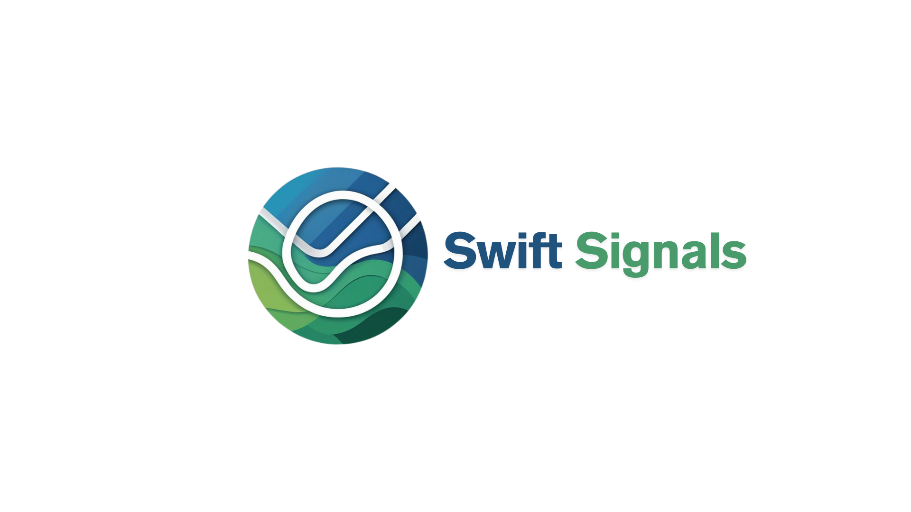

# Swift-Signals

# Badges

# Team
**Team InsideInsights - Swift-Signals**  

Swift Signals is a data-driven, simulation-powered traffic light optimization platform designed to address traffic congestion in urban environments. Developed in collaboration with Southern Cross Solutions, the project aims to equip municipal traffic departments with advanced tools to analyse intersection performance and improve traffic signal efficiency using machine learning.
Traffic congestion remains one of South Africa’s most costly infrastructure challenges, with the South African Road Federation estimating annual productivity losses of approximately R1 billion. Swift Signals tackles this issue by providing a modular, web-based platform capable of simulating real-world intersection behaviour and dynamically optimizing traffic light phase configurations using historical traffic data. The system leverages modern software engineering principles—microservices, containerization, and continuous deployment pipelines—to deliver a scalable and maintainable solution.

## Key Links

### Demo 2
- [Functional Requirements (SRS)](docs/Demo2/SRSV2.pdf)
- [User Manual](docs/Demo2/UserManual.pdf)
- [Architectural Requirements Document](docs/Demo2/ArchitecturalRequirements.pdf)
- [Coding Standards and Practices](/docs/Demo2/CodingStandardsPractices.pdf)
- [GitHub Project Board](https://github.com/orgs/COS301-SE-2025/projects/116)
- [Team Wiki](https://github.com/COS301-SE-2025/Swift-Signals/wiki)
- [Demo 2 Video](https://drive.google.com/file/d/1aziHGN7oFnAVXir01R-gUUyE7hT6cnv7/view?usp=sharing)

### Demo 1

- [Functional Requirements (SRS)](docs/Demo1/SRS_Swift_Signals.pdf)
- [Demo 1 Video](https://drive.google.com/drive/folders/1atNvpmhXaGXENKEQayBK2XgDB_K1cdJR?usp=sharing)

## Team Members

### Joshua Garner  
**Frontend Lead Developer | UI/UX Specialist**  

Joshua Garner is a final-year Information and Knowledge Systems student at the University of
Pretoria, specializing in the Data Science stream. He is a hands-on developer who combines a
love for clean code and smart design with a passion for turning ideas into functional, well-crafted
software.

[LinkedIn](https://www.linkedin.com/in/joshua-garner-a893ba286?utm_source=share&utm_campaign=share_via&utm_content=profile&utm_medium=android_app)

### Patterson Rainbird-Webb  
**Database Engineer | Simulation Developer**  

Patterson Rainbird-Webb is a final year BIS Multimedia student at the University of Pretoria
who is looking to pursue a postgraduate degree in BSc Computer science specializing in
Accessibility through the use of Artificial Intelligence systems.

[LinkedIn](https://www.linkedin.com/in/patterson-rainbird-webb-221310202/)

### Shravan Seebran  
**Backendend Developer | API Developer | Backend Integration**  

Shravan Seebran is a final-year BSc Mathematics student, pursuing the Computer Science
elective stream. His academic experience has provided him with a strong foundation in
problem-solving, algorithm design, and logical reasoning — strengths he actively applies to
real-world software development challenges.

[LinkedIn](http://www.linkedin.com/in/shravan-seebran-045594291)

### Kgosi Segale  
**Frontend Developer | UI/UX Specialist | Documentation**  

Kgosi Segale is a final year BSc Information and Knowledge Systems student at the University of
Pretoria who is also looking to expand his knowledge into data science. He possesses the ability
to master new skills quickly while possessing a drive to solve any and all problems he may
encounter along the way as efficiently and effectively as possible.

[LinkedIn](https://www.linkedin.com/in/kgosi-segale-aab909355/)

### Christopher Xides  
**DevOps | System Architecture**  

Christopher Xides is a dedicated BSc Mathematics student, pursuing a double major in
Computer Science. With a strong foundation in logic and analytical reasoning, he excels in
solving complex problems and applies this strength to software development and algorithm
design.

[LinkedIn](https://www.linkedin.com/in/christopher-xides-253758308?utm_source=share&utm_campaign=share_via&utm_content=profile&utm_medium=ios_app)

## Services Overview

- **frontend**: Web dashboard for visualization and control
- **api-gateway**: API Gateway for routing requests  
- **user-service**: User management and authentication  
- **intersection-service**: Intersection control and management  
- **simulation-service**: Simulation engine  
- **optimization-service**: Machine learning and AI capabilities  

## Getting Started

1. Clone this repository  
2. Run `./scripts/setup.sh` to set up the development environment  
3. Run `docker-compose -f deployments/docker-compose.yml up` to start local development

## Documentation

See the [Development Guide](docs/development-guide.md) for detailed setup and contribution steps.
